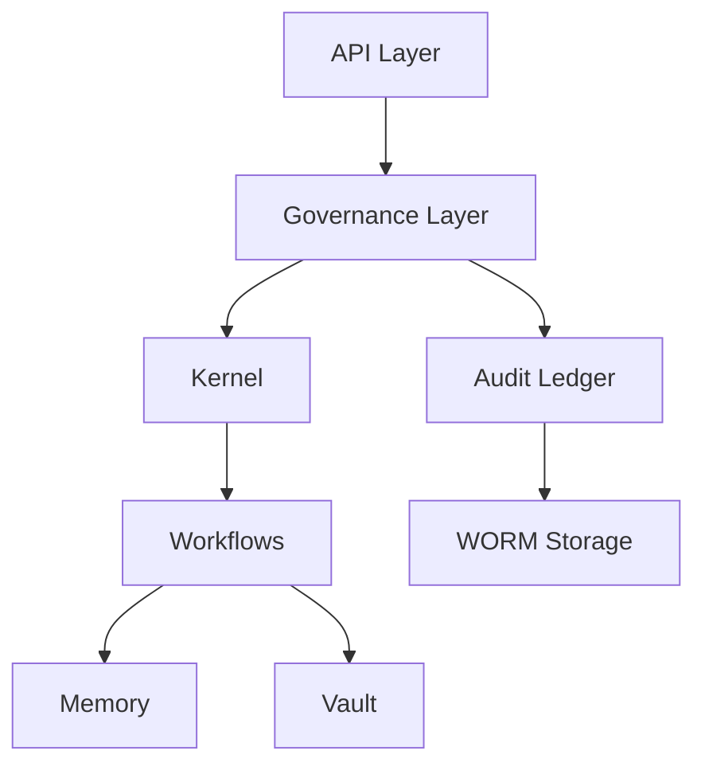
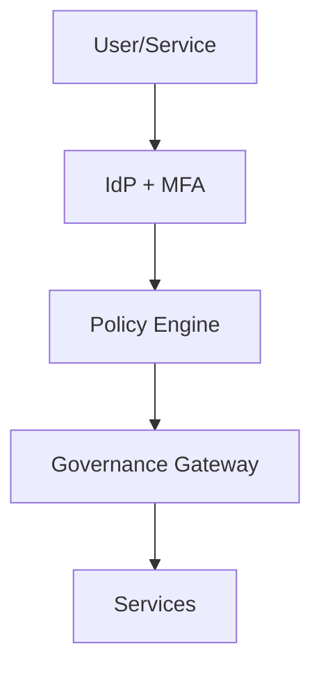

# Phase 5 Full Spec: Enterprise Readiness, Compliance, and Commercialization

## 1) SOC2 / ISO 27001 / DPDP Control Mapping Table

### Control Mapping Matrix (excerpted core controls)
| Control ID | Control Objective | SOC 2 (TSC) | ISO 27001:2022 Annex A | DPDP Act 2023 | Evidence Source | Owner |
| --- | --- | --- | --- | --- | --- | --- |
| C-001 | Identity & access provisioning | CC6.1, CC6.2 | A.5.15, A.5.16, A.5.18 | Sec 8(4) | IAM logs, access reviews | Security |
| C-002 | MFA for privileged access | CC6.3 | A.5.17 | Sec 8(4) | IdP policy export | Security |
| C-003 | Least privilege enforcement | CC6.6 | A.5.15, A.5.18 | Sec 8(4) | Role policy diffs | Security |
| C-004 | Change control approvals | CC8.1 | A.8.32 | Sec 8(4) | PR approvals, CI logs | Engineering |
| C-005 | Secure SDLC | CC8.1 | A.8.28 | Sec 8(4) | CI security reports | Engineering |
| C-006 | Audit logging & retention | CC7.2 | A.8.15, A.8.16 | Sec 8(4), 8(7) | Ledger exports | Compliance |
| C-007 | Data minimization & retention | CC3.1 | A.5.34 | Sec 8(7) | Retention policy logs | Compliance |
| C-008 | Encryption in transit | CC6.7 | A.8.24 | Sec 8(5) | TLS configs | Security |
| C-009 | Encryption at rest | CC6.7 | A.8.24 | Sec 8(5) | KMS configs | Security |
| C-010 | Incident response | CC7.3, CC7.4 | A.5.25, A.5.26 | Sec 8(6) | IR drills, postmortems | Security |
| C-011 | Backup & disaster recovery | CC7.2, A1.2 | A.8.13, A.5.30 | Sec 8(4) | DR test reports | SRE |
| C-012 | Vendor risk mgmt | CC9.2 | A.5.19 | Sec 8(4) | Vendor assessment logs | Compliance |
| C-013 | Breach notification | CC7.4 | A.5.25 | Sec 8(6) | Notification logs | Compliance |
| C-014 | Consent management | CC2.1 | A.5.10, A.5.12 | Sec 6, 7 | Consent records | Product |

**Note**: Full control mapping extends to all 93 ISO 27001 controls via Statement of Applicability (SoA) and all applicable SOC2 CC/A/C criteria.

---

## 2) Evidence Generation Workflows

### Evidence Pipeline (Automated)
1. Control-tagged events emitted via governance ledger (immutable hash chain).
2. Daily export job compiles evidence bundles per control ID.
3. Evidence bundles stored in WORM storage with integrity hash.
4. External auditor portal provides read-only access to evidence catalog.

### Evidence Sources
- **IAM**: access reviews, role diffs, MFA policy exports
- **CI/CD**: signed build artifacts, test results, approvals
- **Vault Ledger**: governance decision logs, policy enforcement
- **Observability**: uptime, latency, error metrics
- **DR/BCP**: restore test logs, RTO/RPO reports

---

## 3) Security Architecture Diagrams

### Data Flow & Enforcement

### Access Control Model

---

## 4) Incident Response Playbooks

### SEV1: Active Data Breach
- Detect via audit ledger or SIEM alert.
- Contain: isolate tenant, revoke access, block tokens.
- Notify: regulator + affected tenants (DPDP mandatory).
- Forensics: collect ledger and system snapshots.
- Recover: rotate keys, restore clean state.

### SEV2: Policy Enforcement Failure
- Freeze workflows under affected policy.
- Roll back policy version.
- Validate audit trail integrity.
- Postmortem within 5 business days.

---

## 5) DR / BCP Plans

### DR Objectives
- **RTO**: 4 hours (Tier 1), 24 hours (Tier 2)
- **RPO**: 15 minutes (Tier 1), 4 hours (Tier 2)

### DR Test Cadence
- Quarterly full failover tests
- Monthly backup restore tests

---

## 6) Pilot Onboarding Handbook

### Onboarding Flow
1. Security questionnaire and risk classification
2. Tenant provisioning with isolated keys
3. Sandbox validation workflow
4. Shadow-mode deployment
5. Production pilot

### Success Metrics
- % workflows governed
- Latency impact
- Policy violation rate
- Audit completeness rate

---

## 7) Billing + Contract Enforcement Design

### Metering
- Per-tenant usage counters
- Governance decisions and workflow executions metered

### Enforcement
- Feature flags by contract tier
- Automatic hard limits with policy enforcement

### Invoicing
- Exportable invoices with audit trail
- Integration hooks for external billing systems

---

## 8) Cost + Staffing Model (12–24 Months)

### Staffing
- Security (4–6)
- Compliance Ops (3–5)
- SRE (4–8)
- Platform Engineering (6–12)
- Customer Success / Pilot Ops (3–6)

### Cost Estimate
- Infrastructure: $3M–$8M
- Compliance operations: $2M–$5M
- Security & tooling: $1M–$3M
- Total 12–24 months: **$8M–$20M**
