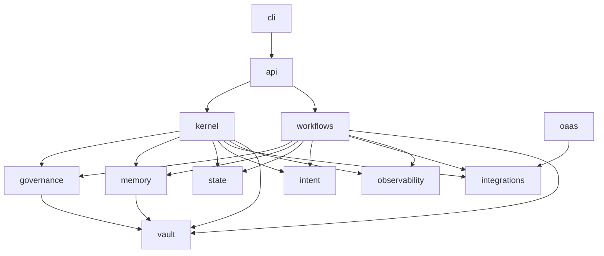

# System Overview

## Purpose
illuu is an enterprise-grade Agent Operating System designed for governed, auditable, and deterministic AI execution.

## Non-Negotiable Guarantees
- All execution is governed.
- All decisions are traceable and auditable.
- All modules are testable and isolated.
- No bypass paths for policy enforcement.

## High-Level Modules
- kernel/: Governed execution core and dependency orchestration.
- workflows/: Workflow engine and YAML-defined flows.
- governance/: Policy enforcement, proxying, and audit hooks.
- memory/: Knowledge Vault and traceable context binding.
- state/: Hot/cold state, checkpoints, and recovery.
- vault/: Cryptographic ledger and evidence storage.
- intent/: Intent scoring and explainability signals.
- oaas/: Optimization-as-a-Service (invoked via integrations).
- integrations/: External connectors and SDK interfaces.
- observability/: Logging, tracing, metrics, error taxonomy.
- api/: Control plane endpoints (no domain logic).
- cli/: Operator tooling (no domain logic).

## API Layer
The unified API surface lives in api/ and exposes both namespaced and legacy-compatible routes. Legacy module APIs remain available via shims during consolidation.

## Observability Layer
observability/ contains vendor-agnostic logging, tracing, metrics, and dashboard assets. Legacy monitoring assets are being migrated from vault/monitoring with compatibility shims.

## Integrations Layer
integrations/ hosts the unified connector framework and adapters for external systems. Legacy connectors are migrated into integrations/adapters with compatibility shims.

## Dependency Direction
Control plane modules depend on domain interfaces. Domain modules do not depend on control plane.

## Execution Path (Abstract)
1. Kernel receives task.
2. Governance validates intent and policy.
3. Memory provides traceable context.
4. Workflow engine executes steps.
5. Vault records ledger events.
6. State layer checkpoints progress.
7. Observability emits telemetry.

## Dependency Diagram

## References
- docs/adr/ADR-0001-canonical-module-boundaries.md
- docs/adr/ADR-0002-governance-single-enforcement-plane.md
- docs/adr/ADR-0003-ledger-owned-by-vault.md
- docs/adr/ADR-0004-all-external-calls-proxied.md
- docs/adr/ADR-0005-memory-traceability.md
- docs/adr/ADR-0006-workflow-engine-isolation.md
- docs/adr/ADR-0007-observability-centralization.md
- docs/adr/ADR-0008-control-plane-purity.md
